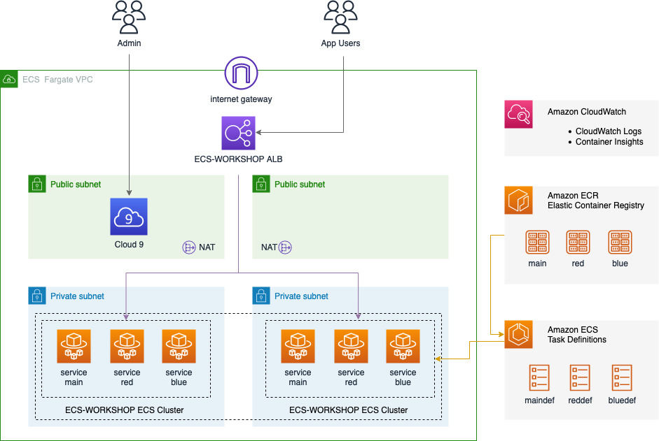

# ECS Fargate Workshop

This workshop goes through setting up an ECS Cluster using a web app, called Blue Red. The workshop takes you through how to configure ECS task definitions and services. During the workshop you configure a Application Load Balancer that is used to put the Blue Red app on the internet. 

The workshop uses CloudWatch Container Insights. You are taken through how to configure an alarm and confgiure Autoscaling Policies that scales out the Blue Red Application when it is under load.

The following services are used as part of this workshop:

 - AWS CloudFormation
 - AWS ECS Fargate
 - Elastic Load Balancing - Appplication Load Balancer
 - Amazon VPC
 - Amazon Container Insights
 - Amazon CloudWatch
 - AWS Auto Scaling





## Getting Started

[Follow the instructions to set the environment up when attending the ECS Fargate AWS workshop](https://github.com/olileach/ecs-workshop/raw/main/ecs-fargate-immersion-day-workshop.pdf). 

Logging in to your AWS console and running AWS CloudFormation should take 15 minutes or so. Once the AWS CloudFormation setup has been completed, log into the Cloud9 environment set up by AWS CloudFormation and run the following command in a terminal window:

```
sh ecs-workshop/setup.sh
```

The setup.sh file will configure the aws cli and build and deploy 3 docker containers, which are used as part of the workshop. Setup should take 3-5 minutes. Overall, you should have deployed your ECS Fargate in around 20 minutes and will begin deploying the Blue Red app. 

Good luck with the ECS Fargate workshop.

 ### Author

 Oli Leach - AWS Principal Solution Architect

 ---
